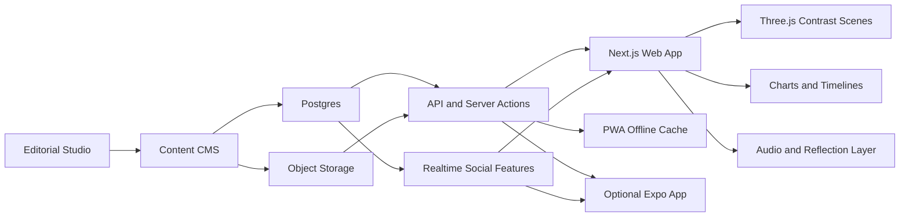
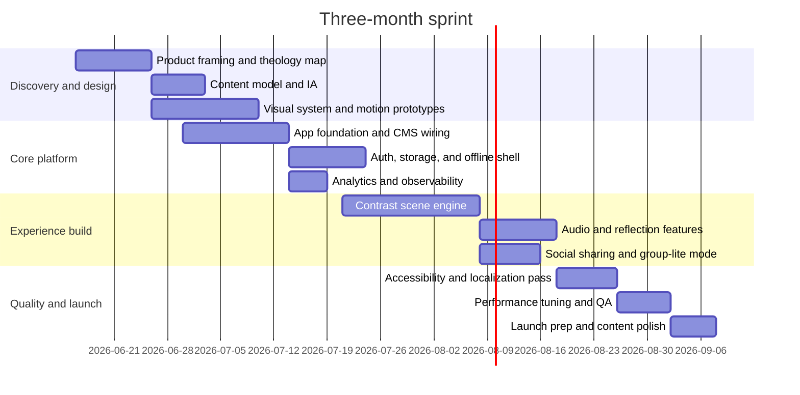

# Network Effect Reverse Engineering and Spin-Off Architecture Report

## Executive summary

Network Effect was not a conventional content site with a modern component framework. Its own epilogue identifies a custom-built stack: a JavaScript front end using jQuery, WebGL, Three.js, custom GLSL shader work, a Python back end, Google App Engine for hosting, Google Cloud Storage for assets, and a homegrown FFmpeg-based media pipeline. It also discloses its core data sources: YouTube, Twitter, Google Books Ngrams, Google News, and Amazon Mechanical Turk. In other words, the project was built as a bespoke data-and-media system, not as a CMS theme or off-the-shelf web app. citeturn54view0turn54view3turn54view4turn56view0

The strongest reverse-engineering conclusion is that the site’s logical center is a single canonical entity, the **behavior**, with multiple attached modalities: short video clips, spoken tweet recordings, crowd-guessed brand and prevalence data, text corpora for “definitions” and “reasons,” historical language trends from Books Ngrams, news headlines over time, and a per-user time-limit mechanic derived from IP geolocation and country life expectancy. That architecture explains the site’s unusual narrative style: it is a behavior-centric audiovisual database presented as an immersive, anxiety-inducing exhibition. citeturn55view0turn56view0

Publicly, the most important official artifact is the epilogue itself, because it functions as a design document, production postmortem, credits page, and technical stack disclosure all at once. Supporting public artifacts include Jonathan Harris’s official portfolio lineage through projects like *We Feel Fine*, *10x10*, *The Whale Hunt*, and *I Love Your Work*; the project’s disclosed press kit download and Instagram output; and a Wired feature that independently described the work as a critique of internet overload built from 10,000 one-second YouTube clips plus text from social and news sources. citeturn55view0turn56view0turn53news0

For your faith-based spin-off, I would not replicate the 2015 stack literally. The best modern interpretation is a **content-led, immersive web app** built with **Next.js** for app structure and streaming UI, **Three.js** for high-impact 3D moments, **Supabase** for structured content plus optional real-time collaborative or social features, and either **Cloudflare Workers/Pages** or **Vercel** for global deployment. For mobile, I would keep a high-quality PWA as the first product and add an Expo-based native shell only if you want deeper device features such as richer haptics, app-store distribution, or camera-native AR workflows. citeturn34view0turn34view2turn43view0turn43view2turn37view0turn51view0turn51view5turn44view1turn48view0turn44view4

The guiding product idea should be to turn “behavior” into **contrast**. Instead of one neutral behavior node like “swim” or “stare,” your primary object is a **contrast pair** or **contrast constellation**, such as “patience vs anger,” “kindness vs envy,” or “faithfulness vs self-centeredness,” with each topic rendered through proportion, before/after narrative, reflection prompts, audio, visuals, and optional embodied interactions. This keeps the original project’s immersive “database as meaning machine” structure while aligning it to spiritual formation rather than social critique. That recommendation is an interpretation and extension of the original site’s structure rather than a claim about the original creators’ intent. citeturn55view0turn56view0

## How Network Effect was created and programmed

The official epilogue is unusually explicit about how the project was built. It says the front end is written in JavaScript using jQuery and WebGL through Three.js, with GLSL shader code sourced from or inspired by Felix Turner, Altered Qualia, and Iñigo Quílez. It says the back end is Python, hosted on Google App Engine and Google Cloud Storage, and that the video/audio pipeline is a custom adaptation of FFmpeg. It further states that the data comes from YouTube, Twitter, Google Books Ngrams, Google News, and Mechanical Turk. Those disclosures are the highest-confidence public evidence available for the site’s stack. citeturn54view0turn54view3turn54view4turn56view0

The site’s own production numbers are also revealing. At launch it reported 4,366,950 data points, 10,000 collected YouTube videos, 10,000 tweet recordings read aloud, and 36,760 total lines of code, divided into 24,413 lines of data processing and 12,347 lines of interface code. That split strongly suggests the project was as much a data-engineering system as a visual website. The “site” was really the display layer for a much larger ingestion, cleaning, transformation, and curation pipeline. citeturn54view7turn56view0

The data model can be reconstructed with fairly high confidence from the epilogue. The root entity is a list of 100 canonical, corporeal, temporally universal human behaviors. For each behavior, the creators assembled or derived at least these associated datasets: 100 short video clips, 100 spoken tweet sentences, brand associations, “definitions,” gender-over-time data from Books Ngrams, news headlines over time, crowd-estimated prevalence counts, “reasons” from Twitter, usage history from Books Ngrams, neighboring-word landscapes, and interface-specific artifacts such as credits thumbnails and interactive histograms. This is not the literal database schema, but it is the clearest public logical schema that the project exposes. citeturn55view0turn56view0

A concise reconstruction of the original system looks like this:

| Layer | What the official sources show | Reverse-engineered implication | Evidence |
|---|---|---|---|
| Content root | 100 canonical human behaviors | Behavior-centric domain model | citeturn55view0 |
| Media ingestion | Mechanical Turk finds 2-second YouTube examples; custom review workflow | Human-in-the-loop sourcing plus moderation queue | citeturn54view6turn55view0 |
| Media processing | FFmpeg adapted to trim, crop, speed up, and merge | Server-side transcoding and composition pipeline | citeturn54view6turn54view3 |
| Text ingestion | Twitter queries for “reasons” and “definitions”; Google News crawling; Books Ngrams queries | Scheduled API/crawl jobs producing hourly and historical datasets | citeturn54view6turn55view0turn56view0 |
| Quantification | Crowd surveys for brands and people counts | Derived summary tables or denormalized aggregates | citeturn54view6turn55view0 |
| Front end | JavaScript + jQuery + WebGL + Three.js + GLSL | Custom imperative UI, likely bespoke scene/state orchestration rather than framework-driven components | citeturn54view0turn54view5 |
| Back end | Python on App Engine + Cloud Storage | API/render endpoint layer plus object storage for media assets | citeturn54view3turn54view4 |
| Time lock mechanic | IP-to-country mapping + life expectancy lookup + 24-hour block | Session state plus server-side gating logic keyed to geography/time | citeturn55view0turn56view0 |

Some parts remain underdocumented. The official sources do **not** publicly disclose a named bundler, CI/CD system, analytics vendor, observability tool, or exact deployment workflow. Because the project launched in 2015 and declares only jQuery, Three.js, Python, App Engine, Cloud Storage, and FFmpeg, the safest conclusion is that the build/deploy pipeline was probably custom and much simpler than a modern webpack/Turbopack/Vite chain, but that part is not publicly verifiable from the sources I found. citeturn56view0

The same goes for asset delivery. Google Cloud Storage is explicitly disclosed, so file and media hosting there is clear. A separate `files.network-effect.io` press-kit asset host is also disclosed. But I found no official technical statement that names a CDN layer, even though cloud storage plus a high-performance-browser requirement makes cached media delivery very likely in practice. That specific CDN attribution should therefore be treated as unverified. citeturn56view0

## Interaction design and public artifact map

Network Effect’s UX is built around deliberate emotional pressure. The site says it is “designed to be viewed on a larger screen,” recommends headphones, prefers “a high-performance browser,” and specifically asks users to revisit using Chrome because of a Safari video-playback issue. Once inside, it frames the experience with a time-limit tied to the visitor’s country life expectancy, after which access is blocked for 24 hours. The epilogue explicitly says this design is intended to induce panic, anxiety, and fear of missing out, mirroring internet culture itself. citeturn54view0turn55view0turn56view0

The interaction patterns are highly legible even without source code. The site offers a central audiovisual stream of very short clips, layered sound montages assembled from spoken tweets, interactive filtering and histogram views for several datasets, a credits gallery of all 10,000 clips organized by behavior, a special “Chatter” interaction triggered by press-and-hold that floods the interface with “MORE MORE,” and a hard epilogue state that replaces the main experience with clouds and a Carl Jung quotation after the timer expires. This is a classic exhibition-style state machine: onboarding state, immersive browsing state, contextual drill-down states, overload interaction state, and locked epilogue state. citeturn55view0turn56view0

The best way to think about its state management is **custom imperative orchestration**. Because the disclosed front end is jQuery + WebGL/Three.js rather than React/Vue/Svelte, state was probably managed through application objects, event handlers, timers, scene controllers, and query/filter parameters, not through declarative component trees. That is an inference, but it is a high-confidence one grounded in the disclosed stack and the interaction model the site describes. citeturn54view0turn54view5turn56view0

The project also fits cleanly into Jonathan Harris’s earlier line of work. The official credits connect it to Harris’s portfolio of data-poetic interactive works including *We Feel Fine*, *10x10*, *The Whale Hunt*, and *I Love Your Work*. That lineage matters for your spin-off because it shows that Network Effect is less a one-off “website” than a continuation of a pattern: collect living or quasi-living public data, reduce it to an emotionally resonant conceptual frame, and present it as an immersive narrative interface. citeturn55view0

The main public artifacts I found are summarized below.

| Artifact type | What is publicly available | Why it matters |
|---|---|---|
| Official technical/postmortem artifact | The Network Effect epilogue | Primary source for stack, datasets, interaction model, numbers, and credits. citeturn54view0turn56view0 |
| Official creator provenance | Jonathan Harris and Greg Hochmuth bios within the epilogue | Establishes prior project lineage and Greg’s data-science/product background. citeturn55view0 |
| Official related projects | *We Feel Fine*, *10x10*, *The Whale Hunt*, *I Love Your Work* | Best available map of adjacent conceptual/technical precedents. citeturn55view0 |
| Official distribution artifact | Press zip on `files.network-effect.io` and project Instagram account | Confirms promotional/public-output infrastructure beyond the main site. citeturn56view0 |
| Institutional context | New Inc / New Museum workspace acknowledgement | Places development in an art/technology incubation context. citeturn54view4 |
| Independent press | Wired feature from October 2015 | Confirms public reception and key experiential framing. citeturn53news0 |

I was **not** able to verify a public source-code repository, developer blog post, or interview that explains the implementation in more detail than the epilogue. That does not prove none exists, but it does mean the epilogue remains the highest-confidence public artifact for technical reconstruction.

## Modern alternatives and improvements

If you rebuilt this concept today, the biggest architectural shift would be to separate **content modeling**, **immersive rendering**, and **distribution** more cleanly than the 2015 custom stack appears to have done. Modern frameworks make that much easier. Next.js’s App Router supports layouts, server components, streaming, and component-level data fetching, all of which are valuable for an experience that mixes narrative scenes, charts, text, and media-heavy transitions. SvelteKit is also strong here, especially if you want simpler mental overhead and smaller client bundles, and its docs explicitly emphasize performant web applications, configurable rendering, offline support, image optimization, and adapters for multiple deployment targets. citeturn34view0turn34view2turn37view0

For immersive visuals, Three.js is still the pragmatic choice. Its current docs and site continue to make clear that it provides a large ecosystem of renderers, controls, post-processing tools, instancing support, and XR-related features. In a modern build, I would use Three.js selectively for a handful of emotionally significant scenes rather than making the entire site a continuous 3D canvas. The original site’s WebGL-first approach was artistically coherent, but today you can preserve the magic while keeping much more of the experience cheap, fast, crawlable, accessible, and localizable. citeturn42view0turn43view0turn43view1turn43view2

For XR and AR, WebXR is viable but should be treated as an enhancement layer, not the core delivery mechanism. MDN notes that the WebXR Device API is limited in browser support, HTTPS-only, and still not “Baseline” across the most widely used browsers. That means WebXR can power an optional prayer-walk AR mode, contemplative headset mode, or embodied contrast-room visualization, but the core learning product should remain accessible on ordinary desktop and mobile web. citeturn41view0

For hosting and edge delivery, the strongest current choices are Cloudflare or Vercel. Cloudflare Workers positions itself as a serverless platform for building and scaling apps across Cloudflare’s global network, and explicitly supports deploying static assets to CDN/cache while connecting back-end logic to data stores and low-latency bindings. Cloudflare Pages adds Git integration, preview deployments, framework support including Next.js and SvelteKit, and built-in functions. Vercel provides serverless functions, streaming support, and integrated analytics. Either platform is defensible; my recommendation depends on whether you prioritize **edge primitives and global control** or **Next.js-first developer ergonomics**. citeturn51view0turn51view1turn51view5turn51view3turn51view4turn44view1turn50view6turn50view7

For real-time or social learning features, Supabase is a clean fit because it gives you structured relational storage plus real-time broadcast, presence, and Postgres change subscriptions. That matters if you want shared reflections, synchronized group experiences, live “contrast room” participation, or time-bound communal practices. citeturn50view1turn50view2

For offline and mobile resilience, the web platform is stronger now than it was in 2015. MDN’s Service Worker API docs and PWA guidance make it straightforward to cache routes and content for offline use, intercept requests, support background sync concepts, and package the app with installable behavior. That makes a strong PWA the best first step for your spin-off, especially if you want “daily reflection” use in low-connectivity contexts. citeturn40view0turn44view4turn46view1

For accessibility and performance, the bar should be much higher than the original. WCAG 2.2 is now the current W3C recommendation and explicitly advises using the most current standard for accessibility efforts. Web Vitals also give a concrete performance target set: LCP within 2.5 seconds, INP at 200 ms or less, and CLS at 0.1 or less, assessed at the 75th percentile. For a faith-based educational product, these should be part of the acceptance criteria, not post-launch cleanup. citeturn39view0turn46view0

For localization, your product should be internationalized from the beginning. W3C’s internationalization guidance is blunt: developers internationalize so localizers can localize later; doing this late is expensive. If you use Next.js, a toolkit such as `next-intl` gives you routing, dates, numbers, and message formatting that match this requirement well. citeturn45view0turn45view2

A concise original-versus-modern comparison follows.

| Concern | Original Network Effect | Recommended modern approach |
|---|---|---|
| App architecture | Custom JS/jQuery/WebGL site with bespoke logic and data pipeline. citeturn54view0turn56view0 | Next.js App Router for content flow, streaming, server rendering, and selective client islands. citeturn34view0turn34view2 |
| Visual engine | Full custom WebGL/Three.js + GLSL. citeturn54view0 | Three.js for key scenes only; standard DOM/SVG/Canvas for the rest to improve accessibility and maintainability. citeturn43view0turn43view2 |
| Backend | Python on Google App Engine with Cloud Storage. citeturn54view3turn54view4 | TypeScript full-stack app plus managed Postgres/realtime layer; deploy on Cloudflare or Vercel. citeturn51view0turn51view5turn44view1turn50view7 |
| Media pipeline | Homegrown FFmpeg adaptation. citeturn54view3 | Managed transcoding pipeline plus precomputed derivatives, captions, waveform data, and image placeholders. |
| Data ingestion | Custom scrapers/APIs and Mechanical Turk workflows. citeturn54view6turn55view0 | Editorial CMS + ETL jobs + moderation workflows; optionally AI-assisted tagging with human theological review. |
| Real-time features | Not publicly emphasized. | Supabase Broadcast/Presence/Postgres Changes for group sessions, social reflections, live prayer walls, or collaborative study. citeturn50view1turn50view2 |
| Mobile/offline | Desktop-oriented, Chrome-preferred, large-screen experience. citeturn54view0turn55view0 | PWA first with service worker caching and installability; add Expo native shell only if deeper device features matter. citeturn40view0turn44view4turn48view0 |
| Analytics | No public disclosure. | Privacy-conscious analytics such as Vercel Web Analytics or Plausible; add product analytics/session replay only if justified. citeturn50view7turn47view1turn47view0 |
| Accessibility | Artistically driven, technically constrained by 2015 browser realities. citeturn54view0 | WCAG 2.2 AA targets, keyboard paths, captions/transcripts, reduced-motion mode, semantic equivalents for immersive scenes. citeturn39view0 |
| Localization | Not publicly emphasized. | Internationalize strings, content metadata, typography, and directionality from day one. citeturn45view0turn45view2 |

## Proposed architecture for the faith-based spin-off

The product concept that best preserves the spirit of Network Effect while serving your goals is an **immersive contrast atlas**. Each chapter is not just a page but a contrast composition: one chosen Fruit of the Spirit on one side, one or more contrasting works-of-the-flesh patterns on the other, and a dynamic middle zone showing proportion, tension, stories, practices, and reflection. Rather than imitating the old site’s “100 behaviors” taxonomy, your root object should be a **ContrastPair** with supporting layers for scripture, commentary, sensory media, comparative visuals, reflection prompts, and shareable outcomes.

A high-level architecture could look like this:

My recommended default stack is this:

| Layer | Recommendation | Why this is the right default |
|---|---|---|
| Application framework | Next.js + TypeScript | Best mix of content routing, interactive islands, streaming, and mature ecosystem. citeturn34view0turn34view2 |
| 3D/immersive layer | Three.js | Mature toolkit for selective high-impact scenes, post-processing, and future XR hooks. citeturn42view0turn43view0turn43view2 |
| Data store | Postgres | Best fit for structured pairings, verses, annotations, user reflections, and multilingual content. |
| Realtime/social | Supabase Realtime | Broadcast, Presence, and Postgres change subscriptions match group or social spiritual practices. citeturn50view1turn50view2 |
| Media storage | Cloud object storage | Durable storage for audio, illustrations, motion assets, transcripts, and share images. |
| Hosting | Cloudflare Pages/Workers if edge-heavy; Vercel if Next.js-first | Both are strong; choose based on team preference and ops style. citeturn51view0turn51view5turn44view1 |
| Offline | Service workers + PWA shell | Strong mobile-web experience without mandatory native build. citeturn40view0turn44view4 |
| Optional native | Expo | Single codebase path for Android, iOS, and web, with deeper device integration when needed. citeturn48view0 |
| Analytics | Plausible or Vercel Web Analytics | Privacy-friendly default better aligned with a reflective faith product. citeturn47view1turn50view7 |
| Error monitoring | Sentry or equivalent | Needed once immersion and media complexity grow. citeturn47view2 |

A sample logical data model for your spin-off is below. This is a proposed schema, not a discovery from the original site.

| Entity | Purpose | Key fields |
|---|---|---|
| `contrast_pair` | Core chapter or lesson | `id`, `slug`, `fruit_label`, `counter_label`, `summary`, `hero_scene_type`, `difficulty_level`, `is_published` |
| `contrast_axis` | Secondary dimensions within a pair | `pair_id`, `axis_name`, `left_weight`, `right_weight`, `description` |
| `scripture_passage` | Canonical text support | `id`, `pair_id`, `reference`, `translation`, `text`, `role` |
| `reflection_prompt` | Guided journaling or group prompts | `id`, `pair_id`, `prompt_type`, `prompt_text`, `age_band`, `locale` |
| `media_asset` | Audio, illustration, motion, share cards | `id`, `pair_id`, `asset_type`, `url`, `alt_text`, `duration_ms`, `transcript_url` |
| `interactive_scene` | Three.js or chart-based scene config | `id`, `pair_id`, `scene_type`, `config_json`, `fallback_mode`, `reduced_motion_variant` |
| `practice_step` | Actionable spiritual exercise | `id`, `pair_id`, `title`, `instructions`, `estimated_minutes`, `offline_available` |
| `user_progress` | Personal learning state | `user_id`, `pair_id`, `completion_pct`, `last_seen_at`, `reflection_saved` |
| `share_card` | Social output | `id`, `pair_id`, `quote`, `theme`, `image_url`, `deep_link_url` |
| `group_session` | Live cohort or church-group experience | `id`, `pair_id`, `host_user_id`, `starts_at`, `mode`, `presence_enabled` |

The feature list I would prioritize is intentionally focused. The minimum compelling product is: immersive chapter pages, adaptive contrast visualizations, narration plus captions, daily reflection mode, journaling, shareable cards, offline access to recent chapters, and one social feature such as group reflection or “pray with others now.” Optional expansion layers include AR meditation scenes, guided audio journeys, leader-mode for small groups, and staggered curriculum paths for youth, adult, and mixed audiences.

For immersive UX specifically, I would use sensory features in a restrained way:

| Modality | Idea | Implementation note |
|---|---|---|
| Audio | Two-channel contrast soundscape: peaceful harmony versus noisy fragmentation | Web Audio API for layering, ducking, and reactive transitions; always provide transcripts and mute controls. citeturn49view1 |
| Visuals | Proportional “weight of the heart” scenes where virtues expand and distortions contract or vice versa | Three.js scenes driven by content metadata and user choices. citeturn43view0turn43view2 |
| Haptics | Gentle confirmation pulses for moments of completion or reflection checkpoints | Web Vibration API for supported devices; degrade gracefully because browser support is limited. citeturn49view0 |
| AR/VR | Optional AR layer that overlays a “contrast lens” on a physical room or walk | WebXR only as an enhancement, given limited support. citeturn41view0 |
| Gamification | “Formation streaks” and contrast mastery maps, not points-heavy behaviorism | Keep rewards contemplative and non-addictive; emphasize practices completed, not compulsive retention. |
| Adaptive narrative | Reorder scenes based on prior reflections, time available, and whether the user is solo or in a group | Server-side personalization + local cache; preserve user agency and explain why a path changed. |
| Social sharing | Beautiful quote cards, “today’s contrast” cards, short reflection snippets | Use the Web Share API where available and generate OG images server-side. citeturn49view3 |

## Delivery plan, effort, and limitations

The right delivery strategy is a three-month sprint that produces a **PWA-first web product** with one to three polished contrast chapters, a reusable content model, a visual scene system, thoughtful accessibility, and limited but excellent social sharing. Native apps, AR, and full real-time group features should be treated as expansion tracks unless your team is large enough to parallelize aggressively.

A prioritized stack with effort estimates is below.

| Priority | Stack choice | Scope | Complexity | Notes |
|---|---|---|---|---|
| P0 | Next.js + TypeScript + Postgres + object storage | Foundation for web app, content, auth, and APIs | Medium | Fastest path to a durable product. citeturn34view0turn34view2 |
| P0 | PWA shell + service worker caching | Offline recent lessons, installability, resilient mobile use | Medium | Much higher ROI than native at the start. citeturn40view0turn44view4 |
| P0 | Accessibility and localization infrastructure | Captions, transcripts, keyboarding, reduced motion, i18n | Medium | Essential for mission fit and scale. citeturn39view0turn45view0turn45view2 |
| P1 | Three.js scene engine | Hero scenes, motion transitions, embodied contrast visuals | High | Worth it if used selectively. citeturn43view0turn43view2 |
| P1 | Privacy-friendly analytics + error monitoring | Performance, usage, crashes | Low | Use Plausible/Vercel + Sentry-style tooling. citeturn47view1turn50view7turn47view2 |
| P1 | Supabase Realtime | Group presence, live reflection, shared sessions | Medium | Add once solo flow is strong. citeturn50view1turn50view2 |
| P2 | Expo native shell | App stores, richer device APIs, deeper notifications | High | Do after PWA proves retention. citeturn48view0 |
| P2 | WebXR/AR mode | Optional immersive prayer walk or room overlay | High | Good differentiator, poor first milestone because support is uneven. citeturn41view0 |

My effort estimate, assuming an experienced product team and no budget ceiling, is:

| Team shape | Expected outcome in 3 months |
|---|---|
| 1 technical founder + 1 designer + part-time content lead | Strong prototype with 1 polished contrast chapter and partial offline support |
| 2–3 engineers + 1 designer + 1 motion/3D designer + content lead | Production-ready v1 web product with 3–5 chapters, sharing, analytics, accessibility, and performance discipline |
| 4–6 engineers + dedicated content/editorial + audio support | v1 plus native shell or early real-time group features, with far better polish and launch confidence |

The biggest strategic recommendation is this: **do not merely clone Network Effect’s aesthetic**. Clone its underlying method instead. The method is: choose a meaningful conceptual primitive, build a data/content system around it, and design an interface whose emotional logic is inseparable from its technical structure. For your spin-off, the primitive is not “behavior”; it is **moral and spiritual contrast**.

## Open questions and limitations

Some important implementation details about the original site remain publicly unclear. I did not verify a public source-code repository, a detailed engineering interview, a public CI/CD description, or a named analytics/monitoring stack for Network Effect. The epilogue is rich, but it does not disclose everything. Where I inferred custom state management, likely bespoke asset tooling, or probable deployment patterns beyond the officially named services, I have marked those as inference rather than fact. citeturn56view0

I also could not confirm whether the site’s “continues to update hourly” claims for definitions, news, and reasons still reflect currently live ingestion behavior, or whether those statements should be read historically as documentation of the launch-era system. The epilogue presents them as active system behavior, but I did not independently verify the current pipelines. citeturn55view0turn56view0